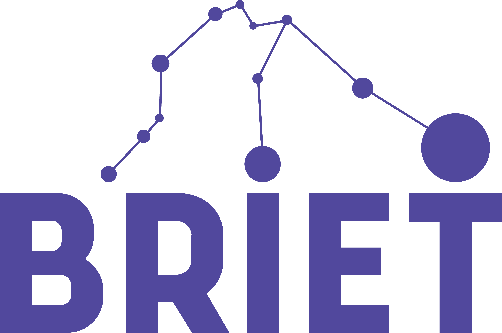

# BRIET: Biblioteconomia, Representação, Interoperabilidade, E-science e Tecnologia

O grupo investiga o conceito de dado de pesquisa e os processos que envolvem sua transformação em informação e conhecimento científico. Estuda os cenários que dão origem à geração, uso e compartilhamento intensivos de dados: eScience, Ciência Aberta, simulação, big data científico versus cauda longa da ciência e que possibilitam o seu reuso para fins de geração de novos conhecimentos, Estuda ainda tecnologias e ferramentas que possibilitam a gestão, a organização, a curadoria, a representação, a encontrabilidade, o acesso, a interoperabilidae e o reuso de dados e informações técnicos-científicas.

## Informações BRIET

### Identificação

| | |
| --- | --- |
| Situação do grupo: | Certificado |
| Ano de formação: | 2017 |
| Data da Situação: | 11/12/2017 13:59 |
| Data do último envio: | 23/05/2022 17:50 |
| Líder(es) do grupo: | Luana Farias Sales Marques e Luis Fernando Sayão |
| Área predominante: | Ciências Sociais Aplicadas; Ciência da Informação |
| Instituição do grupo: | Instituto Brasileiro de Informação em Ciência e Tecnologia - IBICT |
| Unidade: | Departamento de Ensino e Pesquisa |
| Telefone: | +552138739450 |
| Contato do grupo: | [luanasales@ibict.br](mailto:luanasales@ibict.br) |

### Linhas de pesquisa
- **Gestão e curadoria de dados de pesquisa**: estuda aspectos conceituais voltados para a gestão de dados digitais de pesquisa, bem como normas, padrões e tecnologias adequadas para a curadoria digital desses dados, incluindo sua preservação e compartilhamento.
- **Dados FAIR**: estuda a adoção de padrões para tratamento de dados, como metadados, ontologias, identificadores persistentes e demais recursos que possibilitem tornar dados de pesquisa FAIR (findable - encontráveis, acessible - acessíveis, interoperable - interoperáveis, reusable - reusáveis). Se coloca como ponto para reunião de pesquisadores que participam da iniciativa Go-FAIR-Brasil e suas redes de implementação.
- **Organização do conhecimento e recuperação da informação**: estuda os fundamentos teóricos e metodológicos da organização do conhecimento em diferentes contextos de estudo e aplicação. Estuda ainda os sistemas de organização do conhecimento (SOCs)e os processos de tratamento, representação e busca em sistemas de recuperação de informação (SRI)s tradicionais e digitais 
- **Gestão do conhecimento nuclear**: estuda soluções estratégicas para a preservação, compartilhamento e disseminação do conhecimento produzido no domínio das ciências nucleares, tendo como elemento norteador o desenvolvimento científico e tecnológico do país na área nuclear.

### Repositórios
- [CNPQ - Diretório dos grupos de pesquisa no Brasil - Lattes](http://dgp.cnpq.br/dgp/espelhogrupo/5689364231308349)
- [Github - Repositório do Grupo BRIET](https://github.com/grupo-briet)

### Grid cards

# Mapping to the FAIR principles

The [FAIR principles](https://www.go-fair.org/fair-principles/) are a popular set
of principles used by many Knowledge Graph practitioners.

=== "F - Findable"

    

     
    - __FAIR Definition__
                                
        - **F1** -- (Meta)data are assigned a globally unique and persistent identifier
        - **F2** -- Data are described with rich metadata (defined by R1 below)
        - **F3** -- Metadata clearly and explicitly include the identifier of the data they describe
        - **F4** -- (Meta)data are registered or indexed in a searchable resource
    
    - __Differences__
    
        EKG Principles are slightly more specific or prescriptive:
      
        - Metadata (objects) and data (objects) can potentially have multiple identifiers (but at least one).
        - Those identifiers do not necessarily be "persistent" as long as they are (always) resolvable (through HTTP).
        - The EKG identifiers (EKG/IRIs) of data objects (but not necessarily metadata objects) should be
          "opaque" as in "meaningless", (relatively) safe to be emailed around, stored in other platforms,
          maximising "proliferation".
        - FAIR principle **F3** would be phrased the other way around: the data described by metadata refers to it via
          the metadata identifier (i.e. the predicate-IRI).
        - FAIR principle **F4** slightly differs as well, the EKG Principles require metadata to be directly
          resolvable (via HTTP) machine-readable definitions of the semantics in verifiable formal logic
          (preferably OWL 2).
     

=== "A - Accessible"

    

    - __FAIR Definition__

         Once the user finds the required data, they need to know how they can be accessed,
         possibly including authentication and authorisation.
         
         - **A1** -- (Meta)data are retrievable by their identifier using a standardized communications protocol
         - **A1.1** -- The protocol is open, free, and universally implementable
         - **A1.2** -- The protocol allows for an authentication and authorisation procedure, where necessary
         - **A2** -- Metadata are accessible, even when the data are no longer available
    
    - __Differences__
    
         EKG Principles are slightly more specific or prescriptive:
         
         - _"using a standardized communications protocol"_ would be explicitly the HTTP protocol
           (or actually HTTPS/TLS) as a minimum requirement and in addition to that any other protocol, 
           standardized or not.
         - _"metadata are accessible"_ would be more explicit for the EKG: 
           all metadata has to be accessible through IRIs that are always "resolvable" via the HTTP protocol.
           In other words, make sure that all your _OWL 2_ ontologies or _RDF Schema (RDFS)_ 
           vocabularies are placed on highly available durable infrastructure that can always be accessed via HTTP.

    

=== "I - Interoperable"

    

    - __FAIR Definition__

         The data usually need to be integrated with other data.
         In addition, the data need to interoperate with applications or workflows for analysis, storage, and processing.
         
         - **I1** -- (Meta)data use a formal, accessible, shared, and broadly applicable language for knowledge representation.
         - **I2** -- (Meta)data use vocabularies that follow FAIR principles
         - **I3** -- (Meta)data include qualified references to other (meta)data
    
    - __Differences__
    
         EKG Principles are slightly more specific or prescriptive:
         
         - In the EKG the metadata that describes meaning i.e. the semantics
           (there are also many other types of metadata) that 
           _formal and broadly applicable language for knowledge representation_
           has to be preferably _OWL 2_ or at least _RDF Schema (RDFS)_ or _SHACL_.

    

=== "R - Reusable"

    

    - __FAIR Definition__

        The ultimate goal of FAIR is to optimise the reuse of data.
        To achieve this, metadata and data should be well-described so that they can be replicated and/or
        combined in different settings.
        
        - **R1** -- Meta(data) are richly described with a plurality of accurate and relevant attributes
        - **R1.1** -- (Meta)data are released with a clear and accessible data usage license
        - **R1.2** -- (Meta)data are associated with detailed provenance
        - **R1.3** -- (Meta)data meet domain-relevant community standards
        
        The principles refer to three types of entities: data (or any digital object),
        metadata (information about that digital object), and infrastructure.
        For instance, principle F4 defines that both metadata and data are registered or indexed in a
        searchable resource (the infrastructure component).
        
    - __Differences__
    
        EKG Principles are slightly more specific or prescriptive:
        
        - _optimization of the reuse of data is the ultimate goal_. 
          It's an important goal for EKG as well but reuse of knowledge and whole
          use cases---with everything that comes with it---is an even higher level goal.
          Furthermore, overall connectedness of all data and knowledge is an equally important goal.
        - _metadata and data should be well-described_ but should also be as "unbiased" as possible, not designed
          for one particular (set of) use case(s) but designed to represent the version of the truth that a given data
          source provides with the highest level of integrity. 
          See principle [5 -- Self-describing](../principle/05-self-describing.md).
        - _Meta(data) are richly described with a plurality of accurate and relevant attributes_.
          "_Richly described_" would not be specific enough for EKG.
          It would have to be _directly resolvable to a machine-readable definition in verifiable formal logic_.
        - For all types of recognized metadata, which is metadata that services of the various EKG platforms can
          recognize, the EKGF will specify accepted standards or define standards itself or in
          collaboration with partners like the OMG.
          Since an EKG is a collection of self-describing datasets, each dataset will have its 
          various types of metadata organized in a structured way.
    
    

